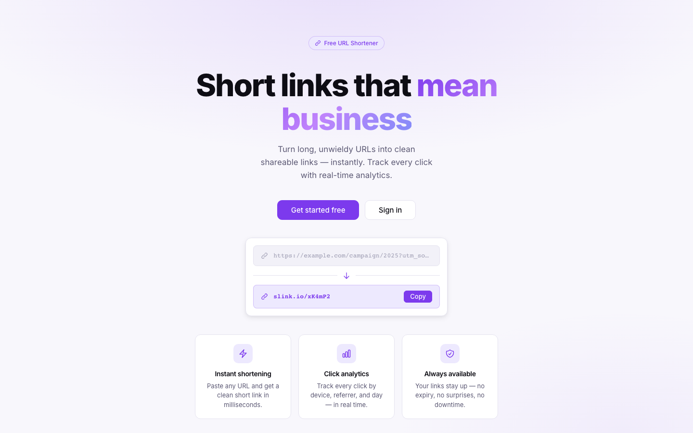

<div align="center">

# 🔗 Shortlink

**Turn long, unwieldy URLs into clean, shareable links — with real-time click analytics.**

A full-stack URL shortener with user authentication, a link management dashboard, and per-link analytics (device type, referrer, click history).




</div>

---

## ✨ Features

- **Instant link shortening** — paste any URL and get a clean short link in milliseconds
- **Click analytics** — track every click by device type, referrer, and time
- **User dashboard** — manage, view, and organize all your shortened links in one place
- **Authentication** — secure sign up / sign in powered by Supabase Auth
- **Fast redirects** — Redis-cached link resolution for near-instant redirects
- **Rate limiting** — built-in API protection against abuse

## 🛠️ Tech Stack

### Frontend (`client/`)
| Tech | Purpose |
|------|---------|
| **React 19** + **TypeScript** | UI framework |
| **Vite 8** | Build tooling (with Rolldown + React Compiler) |
| **Tailwind CSS v4** | Styling |
| **React Router v7** | Client-side routing |
| **Recharts** | Analytics charts |
| **Axios** | API requests |
| **Supabase JS** | Authentication |

### Backend (`server/`)
| Tech | Purpose |
|------|---------|
| **Node.js** + **Express 5** | REST API |
| **PostgreSQL** (via `pg`), hosted on **Supabase** | Primary database |
| **Supabase Auth** | User/session management |
| **Redis** (via `ioredis`) | Link-resolution caching |
| **express-rate-limit** | API rate limiting |
| **ua-parser-js** | Device/click analytics |

## 📁 Project Structure

```
client/   React + Vite frontend
server/
  controllers/   Request handlers (link shortening, redirects, stats)
  routes/        Express route definitions
  middleware/     Auth (Supabase) and rate limiting
  utils/          Shortcode generation, caching, validation, API responses
  db.js           Postgres (Supabase) connection
